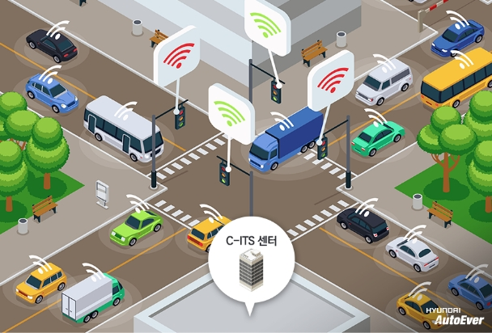

<head>
    <meta charset="UTF-8">
    <meta name="viewport" content="width=device-width, initial-scale=1.0">
    <title>AI 응용 분야 탐험</title>
    <link href="https://cdn.jsdelivr.net/npm/bootstrap@5.3.3/dist/css/bootstrap.min.css" rel="stylesheet" integrity="sha384-QWTKZyjpPEjISv5WaRU9OFeRpok6YctnYmDr5pNlyT2bRjXh0JMhjY6hW+ALEwIH" crossorigin="anonymous">
    
    
</head>
<body data-bs-spy="scroll" data-bs-target="#mainNav" data-bs-smooth-scroll="true" class="scrollspy-example">

    <nav id="mainNav" class="navbar navbar-expand-lg navbar-dark bg-dark sticky-top">
        

            <a class="navbar-brand" href="#hero">✨ AI 응용 분야</a>
            <button class="navbar-toggler" type="button" data-bs-toggle="collapse" data-bs-target="#navbarNav" aria-controls="navbarNav" aria-expanded="false" aria-label="Toggle navigation">
                
            </button>
            

                <ul class="navbar-nav ms-auto">
                    <li class="nav-item"><a class="nav-link" href="#it-field">정보 기술</a></li>
                    <li class="nav-item"><a class="nav-link" href="#medical-field">의료 생명공학</a></li>
                    <li class="nav-item"><a class="nav-link" href="#traffic-field">교통 자율주행</a></li>
                    <li class="nav-item"><a class="nav-link" href="#finance-field">금융 경제</a></li>
                    <li class="nav-item"><a class="nav-link" href="#media-field">미디어 예술</a></li>
                </ul>
            

        

    </nav>

    <header id="hero">
        

            <h1 class="display-3 fw-bold">AI가 이용되는 새로운 분야</h1>
            
AI를 이용하는 사람이라면 누구나 유용한 상식

        

    </header>

    

        
        <section id="it-field" class="py-5">
            <h2 class="section-heading mb-5">🖥️ 정보 기술 분야</h2>
            

                

                    

                        
                        

                            <h5 class="card-title">클라우드 및 서비스 최적화</h5>
                            

                                AI는 서버 부하를 실시간으로 예측하고, 사용량에 따라 가상 리소스를 자동 할당함으로써 클라우드 인프라의 운영 효율을 극대화합니다. 이는 비용 절감과 서비스 안정성 향상에 결정적인 역할을 합니다. 또한 앞에서 나왔던 서부 부하는 서버가 처리해야하는 작업량 또는 요청의 총량을 의미합니다. 
                            

                        

                    

                

                

                    

                        
                        

                            <h5 class="card-title">지능형 보안 시스템</h5>
                            

                             머신러닝모델은 방대한 네트워크 트래픽 데이터를 학습하여 비정상적인 접속 패턴이나 악성코드의 시그니처를 찾아냅니다. 이를 통해 알려지지 않은 제로데이 공격까지 선제적으로 방어합니다. 이때 머신러닝은 컴퓨터가 데이터를 통해 스스로 학습하고, 명시적인 프로그래밍 없이 패턴을 찾고 예측하는 인공지능(AI)의 한분야로, 네트워크 트래픽 데이터는 특정 시간동안 네트워크를 통해 흐르는 데이터의 양입니다. 또한 제로데이는 특정 소프트웨어의 아직까지 공표되지 않거나 혹은 공표되었지만 아직까지 기존 버전과 호환되나 새로운 기능 등이 추가되지 않은 보안 취약점을 이용한 해킹의 통칭입니다. 
                            

                        

                    

                

            

        </section>

        

        <section id="medical-field" class="py-5">
            <h2 class="section-heading mb-5">🩺 의료 생명공학 분야</h2>
            

                

                    

                        
                        

                            <h5 class="card-title">AI 기반 질병 진단 및 예측</h5>
                            

                                딥러닝 모델은 MRI, CT 등 의료 영상을 분석하여 의사가 놓치기 쉬운 미세한 암세포나 병변을 높은 정확도로 검출합니다. 또한, 환자의 데이터를 분석해 발병 위험을 예측하여 예방 의학을 실현합니다.
                            

                        

                    

                

                

                    

                        
                        

                            <h5 class="card-title">신약 개발 및 후보 물질 탐색</h5>
                            

                                AI 시뮬레이션은 수많은 화합물과 단백질의 상호작용을 예측하여 신약 후보 물질을 선별하는 시간을 획기적으로 단축합니다. 이를 통해 신약 개발에 필요한 막대한 시간과 비용을 절감합니다.
                            

                        

                    

                

            

        </section>

        

        <section id="traffic-field" class="py-5">
            <h2 class="section-heading mb-5">🚗 교통 자율주행 분야</h2>
            

                

                    

                        
                        

                            <h5 class="card-title">자율주행 차량 센싱 및 판단</h5>
                            

                             컴퓨터 비전은 차량의 카메라, LiDAR 데이터를 통합하여 실시간으로 3D 환경 모델을 구축합니다. AI는 이 모델을 기반으로 경로를 계획하고, 돌발 상황에서 안전한 운전 판단을 내립니다. 내용을 설명하면서 나왔던 LiDAR 데이터는  'Light Detection and Ranging'의 약자로, 레이저 빛을 이용해 대상 물체까지의 거리를 측정하고 매우 정밀한 3차원(3D) 지도를 만드는 원격 감지 기술입니다.  
                            

                        

                    

                

                

                    

                        
                        

                            <h5 class="card-title">지능형 교통 관제 시스템</h5>
                            

                                도시의 교통량을 학습하고 강화 학습을 통해 최적의 신호등 패턴을 자동으로 도출합니다. 이는 특정 구간의 혼잡도를 완화하고, 출퇴근 시간의 차량 정체를 최소화하는 데 기여합니다. 또한 다중센서를 이용한 실증교차로 내 방향별 차종별 교통량, 접근로별 지 정체 교통 상황 실시간 분석기술을 개발하고 있고, 레이더 및 CCTV를 융항하여 날씨 등 환경인자에 대비할 수 있는 분석기술을 개발하여 실시간 영상과 대시보드를 통해 통계분석 결과 확인이 가능하며, 13가지 비정상 상황 관제 시 위험도 점수를 선정하여 관제 우선순위를 선정할수 있습니다.  
                            

                            <a href="https://smartcity.go.kr/wp-content/uploads/2023/06/28.-3%EB%B6%80-1%EA%B6%8C-%EB%B3%84%EC%B1%851-%EC%A7%80%EB%8A%A5%ED%98%95-%EA%B5%90%ED%86%B5%EC%95%88%EC%A0%84-%EB%B0%8F-%EA%B5%90%ED%86%B5%EA%B4%80%EC%A0%9C-%EC%86%94%EB%A3%A8%EC%85%98_%EB%B0%B0%ED%8F%AC%EC%9A%A9.pdf" target="_blank" class="btn btn-sm btn-outline-primary mt-2">교통 관제 시스템 내용 출처</a>
                        

                    

                

            

        </section>

        

        <section id="finance-field" class="py-5">
            <h2 class="section-heading mb-5">💰 금융 경제 분야</h2>
            

                

                    

                        
                        

                            <h5 class="card-title">로보어드바이저 및 투자 전략</h5>
                            

                                AI 로보어드바이저는 수천 개의 시장 변수를 분석하여 개인투자자에게 맞춤형 포트폴리오를 제공합니다.인간의 감정이 배제된 알고리즘 기반의 투자를 통해 안정적인 수익률을 추구합니다. 이때 로보어드바이저는 '로봇'과 '어드바이저(투자 전문가)'의 합성어로, 인공지능 알고리즘을 활용해 고객의 투자 성향에 맞춰 자산을 자동으로 배분하고 운용해주는 서비스입니다. 
                            

                        

                    

                

                

                    

                        
                        

                            <h5 class="card-title">부정 거래(Fraud) 탐지</h5>
                            

                                카드 거래, 은행 이체 등 금융 기록에서 비정상적인 행동 패턴을 실시간으로 식별합니다. AI가 사기 거래를 즉시 감지하고 중단시킴으로써 고객의 자산을 보호합니다.
                            

                        

                    

                

            

        </section>

        

        <section id="media-field" class="py-5">
            <h2 class="section-heading mb-5">🎨 미디어 예술 분야</h2>
            

                

                    

                        
                        

                            <h5 class="card-title">AI 기반 콘텐츠 생성 (Generative AI)</h5>
                            

                                GAN이나 Transformer 모델은 텍스트 프롬프트만으로 세상에 없던 새로운 그림, 작곡, 심지어 3D 모델까지 창조합니다. 이는 영화, 게임, 광고 산업에 혁명적인 변화를 가져오고 있습니다. GAN모델은 '생성적 적대 신경망'의 약자로, 생성자와 판별자라는 두 개의 신경망이 경쟁하며 실제와 유사한 데이터를 생성하는 인공지능 기술입니다. 이때 생성자는 가짜 데이터를 만들고, 판별자는 진짜와 가짜를 구분하려 싸우면서, 궁극적으로 생성자가 매우 사실적인 데이터를 만들어내는 것을 목표로 합니다. 또한 Transformer 모델은 주로 자연어 처리에 혁신을 가져왔으면 문장 전체를 한번에 처리하며, 순차 데이터의 각 부분간의 관계를 효과적으로 학습합니다. 이 구조는 현재 인공지능 모델의 기반이 되었습니다. 
                            

                        

                    

                

                

                    

                        
                        

                            <h5 class="card-title">개인화된 미디어 추천</h5>
                            

                                추천 시스템 AI는 사용자의 과거 행동 데이터와 유사한 사용자 그룹을 분석하여 다음에 시청할 콘텐츠를 예측합니다. 이는 플랫폼의 사용자 유지율을 높이는 핵심 기술입니다.
                            

                        

                    

                

            

        </section>

    
 <footer class="bg-dark text-white text-center py-3">
        
&copy; 20215 정수영 AI별별아카데미 웹페이지

    </footer>

    
</body>
</html>
